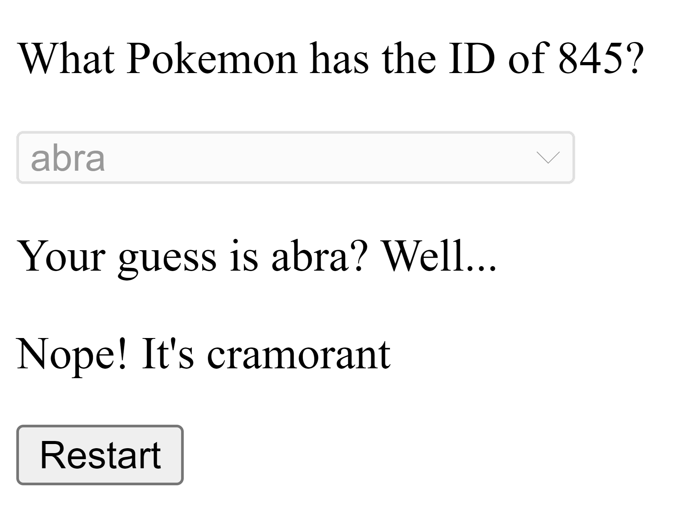

# Angular's Upcoming `linkedSignal` and `resource` API demo

This is a demo of two upcoming features in Angular:

- [`linkedSignal` API](https://github.com/angular/angular/pull/58189)
- [`resource` API](https://github.com/angular/angular/pull/58255)

As well as the ability to be Zoneless in Angular.

This demo is a simple guess-n-check game of Pokemon. The game will randomly select an ID of a Pokemon and the user will have to guess the name of the Pokemon.
